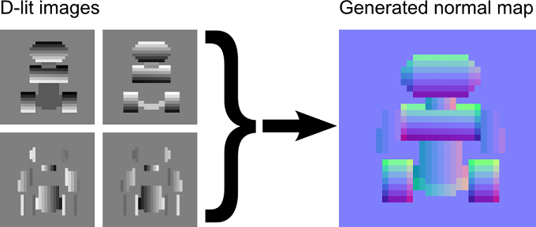
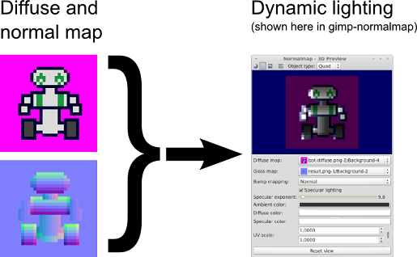
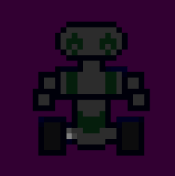

unflattener
===========

Unflattener is a Python module and a command line tool (`unflatten.py`) that generates normal maps for 2D graphics. You can use the generated normal maps to, e.g., make dynamically lit sprites in a video game. Unflattener takes as its input images of your object lit by a light source pointing directly at it from from four directions: top, bottom, left and right (the images are called "directionally lit" or "d-lit" — like "d-pad"). This project was inspired by [Sprite Lamp](http://snakehillgames.com/spritelamp/).

Unflattener is written in Python and requires the libraries NumPy and PIL to run. Right now it cannot do dynamic lighting previews, so you'll need a third-party tool like the [gimp-normalmap](https://code.google.com/p/gimp-normalmap/) plugin for [GIMP](http://www.gimp.org/) for that. Python programs can access Unflattener's functionality directly by importing the `NormalMap` class from the module `normalmapgen`.

Example
=======

How it works
============

The core algorithm is explained in a (rather lengthy) comment in the method `NormalMap.create_from_images` in `normalmapgen.py`. You'll find some tips on how the input artwork should look in the same comment.

Installation
============

Unflattener has been tested to work under Linux (Ubuntu 12.04, Fedora 19 and Debian 7) and Windows (XP, 7 and 8.1).

You'll need Python 2.7 (v2.6 and earlier won't work due to the use of dict comprehensions), NumPy and either PIL (the Python Imaging Library) or its substitute Pillow to run Unflattener. On Debian and Ubuntu you can install the required packages with

    sudo apt-get install python-numpy python-imaging

On Fedora:

    su -
    yum install numpy python-pillow

On Windows first install Python 2.7 using the offical installer then download and run the following package installers from <http://www.lfd.uci.edu/~gohlke/pythonlibs/>:

* numpy-MKL-1.8.0.win32-py2.7.exe
* Pillow-2.2.1.win32-py2.7.exe

Only 32-bit versions of Python and its libraries have been tested on Windows (both 32-bit and 64-bit versions), so it is recommended that you use them.

Clone this repository and run `run.sh` on Linux or `run-win.cmd` on Windows. To generate normal maps for other images edit those files to suit your needs or directly run `unflatten.py`.

Run `tests.py` to verify that everything works correctly.

To install gimp-normalmap on Debian and Ubuntu do

	sudo apt-get install gimp-normalmap

On Fedora:

    su -
    yum install gimp-normalmap

Usage
=====

    usage: unflatten.py [-h] [--top TOP] [--bottom BOTTOM] [--left LEFT]
                        [--right RIGHT] [--output OUTPUT] [--depth DEPTH]

    Generate a normal map for 2D art

    optional arguments:
      -h, --help            show this help message and exit
      --top TOP, -t TOP     top image file
      --bottom BOTTOM, -b BOTTOM
                            bottom image file
      --left LEFT, -l LEFT  left image file
      --right RIGHT, -r RIGHT
                            right image file
      --output OUTPUT, -o OUTPUT
                            output file name
      --depth DEPTH, -d DEPTH
                            normal map z_N range

    One input file minimum, at least two (one for each axis) highly recommended.
    Input files should be 8-bit grayscale PNGs.

Art requested
=============

Wanted: d-lit images for use in testing and to illustrate this very README on GitHub. I'd love to see how Unflattener works for your artwork or game.

[File an issue](https://github.com/dbohdan/unflattener/issues) to have a link to your project added here.

Licensing information
=====================

Unflattener is distributed under the new (3-clause) BSD license. See the file `LICENSE`.

Robot sprite originally from the [Bits & Bots art pack](http://opengameart.org/content/bits-bots-art-pack) by MoikMellah. The sprite and its derivatives are licensed under the Creative Commons CC-BY-SA 3.0 license.
